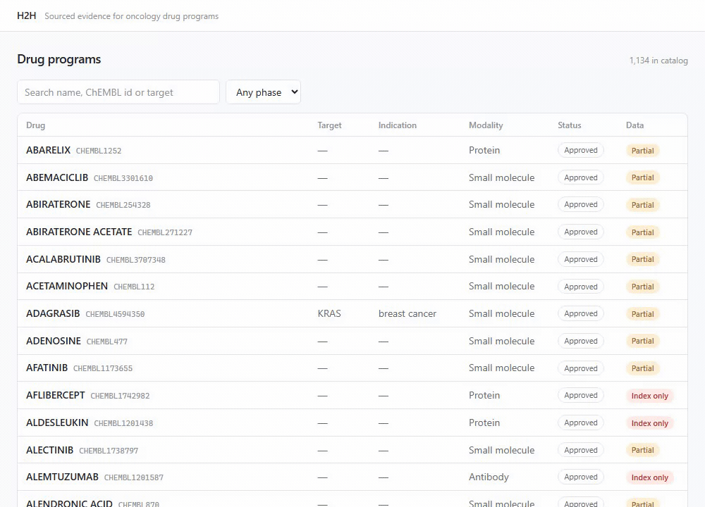
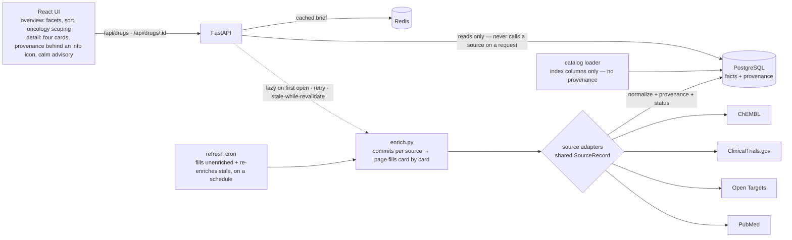

# H2H — sourced evidence for oncology drugs and cancers

> Structure, binding, mechanism and clinical status for any oncology drug; and for any cancer, its drug
> pipeline, target landscape, and which targets are drugged versus unexploited — every fact linked to its
> source, and honest about what's missing.

[](https://github.com/AlsoTheZv3n/h2h-research-v2/actions/workflows/ci.yml)
[](LICENSE)
[](pyproject.toml)
[](frontend/package.json)



## Why this exists

The evidence for a cancer drug is scattered, and where it's aggregated it's either unsourced or
unstructured:

- **Market/finance tools** have the numbers but not the science.
- **General chat assistants** synthesize fluently but hallucinate and cite nothing.
- **The primary databases** — ChEMBL, ClinicalTrials.gov, Open Targets, PubMed — are authoritative but
  raw and disconnected.

H2H connects them into one sourced brief per drug. **Every fact carries its source and retrieval
date**, and gaps are shown honestly instead of papered over.

## What it does

- Browse the oncology drug catalog — filter by target, **target class**, modality and phase, sort any
  column, all in the URL so a view is shareable. Non-oncology false positives the source's blunt
  disease-matching pulls in (statins, contrast agents) are **scoped out by default**, one toggle away.
- Open **any** drug → a brief built from four open databases. It **fills card by card** as each source
  returns rather than blocking on the slowest; a scheduled **refresh cron** warms drugs ahead of demand
  and re-enriches stale ones; and once a brief's facts age past the freshness window it is served
  instantly from storage while a refresh runs behind it (**stale-while-revalidate**).
- Each fact is one of four **honest states**, never conflated: a value (source and date behind an info
  icon), *measured but empty*, *source unavailable*, or *not yet analyzed*.
- Binding is distilled to a **decision-grade potency** — on-target median + range over exact
  measurements — not a raw dump of every activity.
- Biologics and other non-small-molecule drugs are handled honestly: they appear in the catalog, but
  the structure/binding cards say *"not applicable — … is not a small molecule"* (naming the actual
  modality) rather than showing empty panels.
- **Ask a question about the drug** and get an answer built only from that drug's facts and
  abstracts, with every source linked — see below.
- **Browse cancers, not just drugs.** Open any cancer → its **drug pipeline** as a phase distribution
  and a filterable table (linking only the drugs the catalog holds, matched by exact ChEMBL id; the
  count is an ontology roll-up, and the card says so), and its **target landscape** with Open Targets
  association scores and tractability. The associated-targets metric is honest about a threshold
  artifact — it leads with the count of *strong* associations, never the whole-genome total:
  `117 · score ≥ 0.5 · 12,475 with any evidence`. And per target, the cell this tool exists for:
  whether it is **drugged (approved), in development, or unexploited** in the world — sourced from Open
  Targets (not our catalog), joined on stable Ensembl ids, with a separate link to a catalog drug
  against it where we hold one. A high-association target with no drug anywhere is the finding; one
  merely absent from *our* catalog is not. Two more blocks ship beside these — **epidemiology**
  (European age-standardised cancer mortality, from Eurostat) and **survival** (SEER 5-year relative
  survival by stage) — each attached through a MONDO disease crosswalk and each loading and failing on
  its own, with the same honest states: a cancer with no mapped category reads *not available for this
  cancer*, never a false zero.

The cancer view is deliberately partial, and says which parts exist. **Known gaps, named not shipped:**
trial reality (which trials, where, recruiting), the molecular profile, cost-of-care and unmet-need
blocks are not built yet. What is shown is sourced; what is missing is stated rather than faked — the
same discipline as the honest states below. It is a research and drug-intelligence view of the
evidence, not clinical decision support and not medical advice.

Other things were **measured and deliberately left out** — its own kind of honesty, since a measured
"no" is easy to mistake for "not tried":

- **Epidemiology is European mortality, not global incidence.** GLOBOCAN (all-rights-reserved),
  IHME-GBD / OWID (non-redistributable) and CI5 are licence-blocked, so the block uses Eurostat
  age-standardised mortality (open, redistributable) — deaths, not new cases. Myeloma has no separate
  Eurostat rate, so its epidemiology shows as a *labelled* lymphoma roll-up (its survival is exact).
- **No tissue-agnostic badge.** An organ-span count measures commercial breadth, not biomarker
  agnosticism; on a golden set it ranked lung-bound osimertinib above genuinely tissue-agnostic drugs.
  No badge without a biomarker signal Open Targets does not expose.
- **No aggregate sponsor counts.** Big pharma fragments across subsidiaries (~4:1 in the head, and
  Merck KGaA ≠ Merck & Co), so sponsors stay display-only until a curated name map exists.
- **Individualised mRNA vaccines are not catalog drugs.** They have no fixed compound and surface via
  trials, not the drug table — a modality filter over the catalog cannot see them.

### The honest states, and why they are the point

A missing number can mean four different things, and collapsing them is how an evidence tool starts
lying:

| State | Means | Renders as |
|---|---|---|
| `ok` | The source measured it | the value + a citation, its source and retrieval date one hover behind an info icon |
| `empty` | The source measured, and the answer is nothing | a muted *"none found"* |
| `source_failed` | The source was down. **Not a finding.** | a calm amber *"source unavailable"* chip |
| `not_analyzed` | Nobody has asked yet | *"waiting for sources…"* |

ChEMBL returns a 500 often enough that this matters daily. A brief that renders an outage as *"no
mechanism"* tells you something false about the drug; H2H shows the amber chip instead and says which
source failed. When a whole brief has gaps, a calm amber advisory at the top says the picture is
partial — a gap in our pipeline, not a finding about the drug — and offers to fetch the sources again.

## Asking questions

Every drug page has an ask box. The answer is composed only from that drug's stored facts and its
PubMed abstracts — the model is told nothing else and is not permitted to draw on what it knows.

**The distinction the second bullet at the top of this file complains about is the one this has to
earn.** A chat assistant that hallucinates and cites nothing is easy to build; the hard part is
noticing when it happens. Four things do the work:

- **Retrieval is filtered by drug before it ranks.** Without that, the best semantic match for a KRAS
  question is sotorasib's paper — even when you asked about osimertinib. The model would cite it
  correctly while answering about the wrong molecule.
- **The honest states go into the prompt.** If ChEMBL was down, the model is told the mechanism is
  *unretrieved*, not absent, and told to say so. Omitting it would produce "no mechanism is reported"
  — fluent, grounded in what it was given, and false.
- **No evidence means no model call.** Handed an empty context a model answers from training, and
  that answer is indistinguishable from a grounded one.
- **Every citation is checked against what was retrieved.** If the answer cites a PMID we never
  supplied, the model invented it and **the whole answer is withheld** — you are told it happened
  rather than shown something nobody can stand behind.
- **The answer is checked for copied text.** Twelve consecutive words lifted from an abstract also
  withholds it: accurate or not, that text is not ours to republish (see [`NOTICE.md`](NOTICE.md)).

**What the citation check does not do, and it is the bigger half:** it verifies a citation *exists*,
not that it *supports the sentence attached to it*. A fabricated claim hung on a real retrieved PMID
passes. Catching that needs a second model grading each claim against its source — a real piece of
work, not done, and stated here rather than left for you to discover.

The chat needs a model; nothing else here does. Set `ANTHROPIC_API_KEY`, or point `OLLAMA_URL` at a
local one. With neither, the box says so and names the variable — browsing, briefs and literature
search are unaffected, because embeddings run locally inside the API container.

```bash
uv run python -m backend.eval.grounding   # does your model actually stay inside the evidence?
```

That runs five questions built to tempt a model into answering from memory — a mechanism whose source
was down, a dose that is on the label but not in the evidence, a trial result that invites citing
FLAURA from recall. Measured against `llama3.1:8b`: 5/5 clean, no fabricated citations. Claude is the
default on general capability grounds, which is a judgement rather than a measurement — five
questions on one drug is not a benchmark.

## Quickstart

No API keys, no accounts — every source is open.

```bash
git clone https://github.com/AlsoTheZv3n/h2h-research-v2.git
cd h2h-research-v2
docker compose up
```

Then open **<http://localhost:5173>**. That brings up the UI, the API, PostgreSQL and Redis, and a
refresh cron that warms and re-freshens the catalog on a schedule — and applies the migrations on the
way.

The catalog starts empty. Fill it — no host toolchain needed, it runs in the container:

```bash
# A handful of drugs to look at, in about a minute
docker compose exec api python -m backend.ingestion.chembl_catalog \
  --ids sotorasib,adagrasib,osimertinib,"trastuzumab deruxtecan"

# Or the whole oncology catalog: ~3,800 candidates in ChEMBL. Runs long — ChEMBL is
# slow and fails often — but it is idempotent and resumable, so re-run it to fill gaps.
docker compose exec api python -m backend.ingestion.chembl_catalog
```

Then open any drug: it enriches on first view and is cached after. No bulk job required — the catalog
load only decides what is *listed*, not what is *viewable*.

> Ports are overridable in `.env` (`FRONTEND_PORT`, `API_PORT`, …), which matters if something else
> already owns 5173 or 5432.

## Architecture



**The API never calls a source on a user request** — it reads facts from Postgres, so a source being
down stops being a page's problem and becomes "open it again later". Facts get there through one
`enrich.py` job, reached three ways: **lazily** the first time someone opens a drug — committed source
by source, so the page fills card by card instead of blocking on the slowest; by a scheduled **refresh
cron** (`backend.refresh`) that fills never-touched drugs and re-enriches any older than the freshness
window, ahead of demand; and on an explicit **retry** of a failed source. A brief that has itself aged
past that window is served immediately from storage while a refresh runs behind it
(**stale-while-revalidate**), so the reader is never blocked on a re-fetch. `last_enriched_at` is the
one clock all of this shares — the never-touched marker, the freshness gauge, and the resumability
bookmark, in a single column.

Source adapters are a plugin layer: one per source, all behind a shared `SourceRecord`. Entity
resolution deliberately is not — that is typed cross-entity logic and stays cohesive.

## A worked example

Osimertinib's binding card reads:

> **12.66 nM median** — Range 0.9–480,000 nM over 62 exact on-target measurements
> *On target 69 · Censored 7 · Activities 100 · 38 of 100 rows excluded*

That line is the project in miniature. ChEMBL holds **701** IC50 activities for osimertinib; H2H reads
the first 100 and finds that 38 of them cannot carry a potency claim — 31 measure something that is not
EGFR (cell lines and off-target screens, which sit in the same `target_pref_name` field as the real
target), and 7 are censored bounds like `>10000` that state a limit rather than a measurement. Average
all 100 and you get a confident, meaningless number spanning five orders of magnitude.

So the summary matches the drug's own target **by ChEMBL ID** rather than by name, counts censored
bounds instead of averaging them, takes a median rather than a mean, and lists everything it discarded.
The count is a row count; the median is an answer.

The honest caveat, since this section is about not overclaiming: those 62 measurements are drawn from
the first 100 of 701 activities, not all 701. Reading the full set is a paging problem, not a hard one —
it simply isn't done yet.

## Tech

Backend: Python · FastAPI · PostgreSQL + pgvector · Redis · uv · RDKit (renders the structures) ·
fastembed (bge-small, runs on CPU inside the container — the reason retrieval needs no key).
Frontend: React · TypeScript · Tailwind v4 · Vite.
Tests: pytest (+ mypy strict) · Vitest · Playwright. CI: GitHub Actions.

The Playwright suite runs against the real API serving real facts — no mock layer. It is written so
that emptying the `fact` table makes it fail, which is the only way to know a test is load-bearing.

## Data sources & licensing

Built entirely on open data, no API keys required: **ChEMBL** (CC BY-SA), **ClinicalTrials.gov**
(public domain), **Open Targets**, **PubMed** (read locally, never redistributed), **Eurostat** (EU
open-data reuse — the cancer epidemiology block) and **SEER** (U.S. public domain — the survival
block). See
[`NOTICE.md`](NOTICE.md) — the PubMed section is worth reading before you fork this, because NLM
does not own the abstracts it serves and so cannot license them to you either. Literature data
courtesy of the U.S. National Library of Medicine. The software is MIT-licensed (see
[`LICENSE`](LICENSE)).

H2H surfaces evidence. It is not an ML predictor and not an investment advisor.

## Repo layout

| Path | What |
|---|---|
| `backend/` | FastAPI app, data model, source adapters, ingestion, domain logic |
| `frontend/` | React UI |
| `experiment/` | The original throwaway spike that proved the sources carry the product. Kept as reference; not part of the app. |
