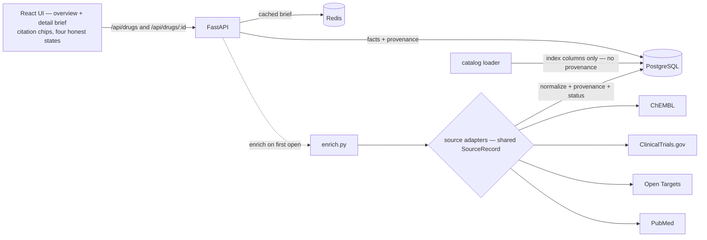

# H2H — sourced evidence for cancer drug programs

> Structure, binding, mechanism and clinical status for any oncology drug — every fact linked to its
> source, and honest about what's missing.

[](https://github.com/AlsoTheZv3n/h2h-research-v2/actions/workflows/ci.yml)
[](LICENSE)
[](pyproject.toml)
[](frontend/package.json)


## Why this exists

The evidence for a cancer drug is scattered, and where it's aggregated it's either unsourced or
unstructured:

- **Market/finance tools** have the numbers but not the science.
- **General chat assistants** synthesize fluently but hallucinate and cite nothing.
- **The primary databases** — ChEMBL, ClinicalTrials.gov, Open Targets, PubMed — are authoritative but
  raw and disconnected.

H2H connects them into one sourced brief per drug. **Every fact carries its source and retrieval
date**, and gaps are shown honestly instead of papered over.

## What it does

- Browse the oncology drug catalog. Open **any** drug → a brief generated on demand from four open
  databases, cached after the first view.
- Each fact is one of four **honest states**, never conflated: a value (with a citation you can
  inspect), *measured but empty*, *source unavailable*, or *not yet analyzed*.
- Binding is distilled to a **decision-grade potency** — on-target median + range over exact
  measurements — not a raw dump of every activity.
- Biologics are handled honestly: they appear in the catalog, but structure/binding cards show
  *"not applicable — this is a biologic"* rather than empty panels.

### The honest states, and why they are the point

A missing number can mean four different things, and collapsing them is how an evidence tool starts
lying:

| State | Means | Renders as |
|---|---|---|
| `ok` | The source measured it | the value + a citation chip |
| `empty` | The source measured, and the answer is nothing | a muted *"none found"* |
| `source_failed` | The source was down. **Not a finding.** | a red *"source unavailable"* |
| `not_analyzed` | Nobody has asked yet | *"waiting for sources…"* |

ChEMBL returns a 500 often enough that this matters daily. A brief that renders an outage as *"no
mechanism"* tells you something false about the drug; H2H shows the red chip instead and says which
source failed.

## Quickstart

No API keys, no accounts — every source is open.

```bash
git clone https://github.com/AlsoTheZv3n/h2h-research-v2.git
cd h2h-research-v2
docker compose up
```

Then open **<http://localhost:5173>**. That brings up the UI, the API, PostgreSQL and Redis, and applies
the migrations on the way.

The catalog starts empty. Fill it — no host toolchain needed, it runs in the container:

```bash
# A handful of drugs to look at, in about a minute
docker compose exec api python -m backend.ingestion.chembl_catalog \
  --ids sotorasib,adagrasib,osimertinib,"trastuzumab deruxtecan"

# Or the whole oncology catalog: ~3,800 candidates in ChEMBL. Runs long — ChEMBL is
# slow and fails often — but it is idempotent and resumable, so re-run it to fill gaps.
docker compose exec api python -m backend.ingestion.chembl_catalog
```

Then open any drug: it enriches on first view and is cached after. No bulk job required — the catalog
load only decides what is *listed*, not what is *viewable*.

> Ports are overridable in `.env` (`FRONTEND_PORT`, `API_PORT`, …), which matters if something else
> already owns 5173 or 5432.

## Architecture



Source adapters are a plugin layer: one per source, all behind a shared `SourceRecord`. Entity
resolution deliberately is not — that is typed cross-entity logic and stays cohesive.

## A worked example

Osimertinib's binding card reads:

> **12.66 nM median** — Range 0.9–480,000 nM over 62 exact on-target measurements
> *On target 69 · Censored 7 · Activities 100 · 38 of 100 rows excluded*

That line is the project in miniature. ChEMBL holds **701** IC50 activities for osimertinib; H2H reads
the first 100 and finds that 38 of them cannot carry a potency claim — 31 measure something that is not
EGFR (cell lines and off-target screens, which sit in the same `target_pref_name` field as the real
target), and 7 are censored bounds like `>10000` that state a limit rather than a measurement. Average
all 100 and you get a confident, meaningless number spanning five orders of magnitude.

So the summary matches the drug's own target **by ChEMBL ID** rather than by name, counts censored
bounds instead of averaging them, takes a median rather than a mean, and lists everything it discarded.
The count is a row count; the median is an answer.

The honest caveat, since this section is about not overclaiming: those 62 measurements are drawn from
the first 100 of 701 activities, not all 701. Reading the full set is a paging problem, not a hard one —
it simply isn't done yet.

## Tech

Backend: Python · FastAPI · PostgreSQL · Redis · uv · RDKit (renders the structures).
Frontend: React · TypeScript · Tailwind v4 · Vite.
Tests: pytest (+ mypy strict) · Vitest · Playwright. CI: GitHub Actions.

The Playwright suite runs against the real API serving real facts — no mock layer. It is written so
that emptying the `fact` table makes it fail, which is the only way to know a test is load-bearing.

## Data sources & licensing

Built entirely on open data, no API keys required: **ChEMBL** (CC BY-SA), **ClinicalTrials.gov**
(public domain), **Open Targets**, **PubMed** (read locally, never redistributed). See
[`NOTICE.md`](NOTICE.md) — the PubMed section is worth reading before you fork this, because NLM
does not own the abstracts it serves and so cannot license them to you either. Literature data
courtesy of the U.S. National Library of Medicine. The software is MIT-licensed (see
[`LICENSE`](LICENSE)).

H2H surfaces evidence. It is not an ML predictor and not an investment advisor.

## Repo layout

| Path | What |
|---|---|
| `backend/` | FastAPI app, data model, source adapters, ingestion, domain logic |
| `frontend/` | React UI |
| `experiment/` | The original throwaway spike that proved the sources carry the product. Kept as reference; not part of the app. |
